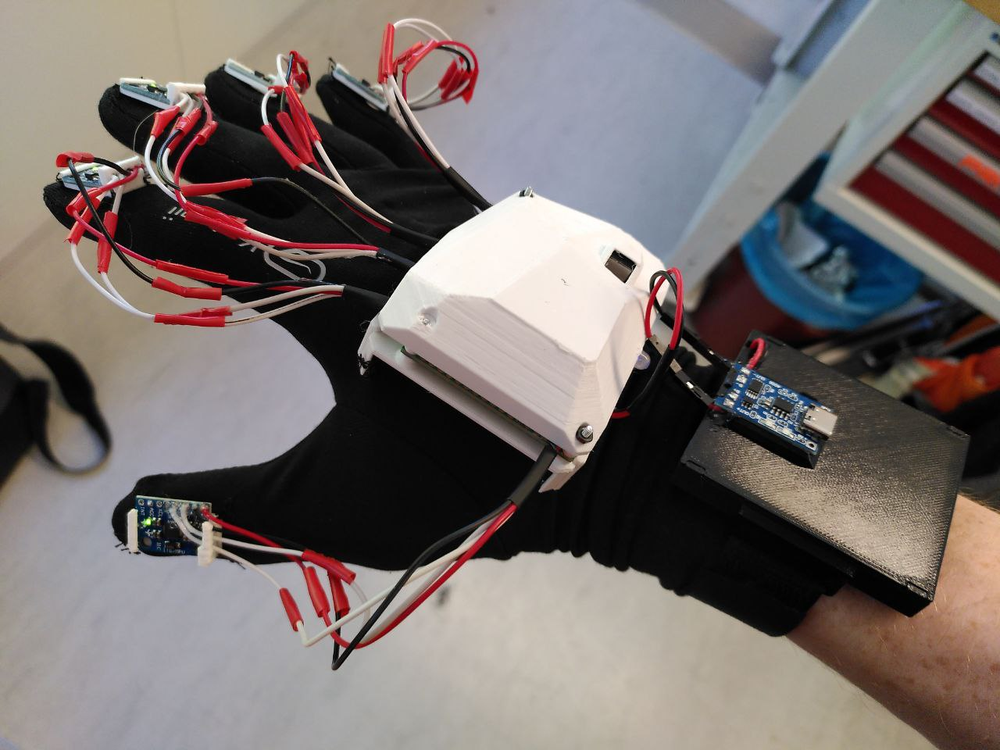

# Building instructions

Here are the steps to follow in order to replicate our motion tracking glove prototype.

# Components

Here are listed the components we used.

- 1x ESP32-CAM
- 1x ESP8266 NodeMCU
- 5x MPU-6050 Breakout Board Module
- 1x Adafruit Precision NXP 9-DOF - FXOS8700 + FXAS21002
- 1x Battery Packs Li-Polymer Battery 3.7V 3000mAh
- 1x TC4056A Lithium Battery Charger and Protection Module
- 1x 24x18 holes universal soldering board
- 1x RGB Led (optional)
- 1x glove (running glove for example)

# 3D printed parts

We provide a file `motion-tracking-glove.3mf` ready to be printed with all the parts of the glove.
Please note that it might be better not to print them all at once, as they take a lot of space on the printer's plate.

All the CAD models are found in the `cad` folder.

# Circuit

we built our circuit on a universal soldering board, which made a good compromise between prototyping speed and robustness.

Here are the circuit schematics for the two sides of the soldering board.

On the top side of the board, just under the ESPs and the NXP sensor are found the Vin and Gnd lines for the whole design.
The two wires coming from the bottom of the image are connected to the battery.
All the other wires going out of the image are connected to the corresponding pins of the MPU-6050s.

On the bottom side are the I2C lines (SCL: orange, SDA: pink), the RGB led connections (color-coded accordingly) and the 4 wires needed to program the ESP32-cam which doesn't have a USB port.
All the I2C wires going out of the image are connected to the corresponding pins of the MPU-6050s.

# Assembly

## Main part

After the wires have been fullly soldered to the circuit, place the ESP8266, the ESP-CAM, and the NXP sensor as shown in the above image.
Before soldering, verify that the circuit is working as it will be painful to desolder it afterwards.
Then solder the components to the board.
The RGB LED placement is not shown on the image, but each pin of the LED should be soldered at the corresponding place in the circuit.

Once the soldering is finished, assemble the cover and the base plate as shown in the image, and screw them together using M2 screws of the appropriate length.
The camera should be easy enough to fit in its enclosure using the little opening on the top of the cover.

The whole part can then be slid into main mount's rail.
This mount has 4 holes on its sides so that it can be sewed to the glove.

## MPU mount

The MPU-mount is pretty straightforward.
The MPU-6050 is meant to be slid into the rail, and the mount to be sewed to the fingertips of the glove using the four holes on the corners.

## Battery case

Place the battery in the case.

Close the case with the cover which should snap in the right place.
Then fix the battery charger module as shown in the picture, after having soldered it to the battery wires.

Finally, fix the wristband loops to the side of the case using hot glue.

## Putting everything together

Here is how it looks when (almost) all the pieces have been put together:

And the final prototype:

